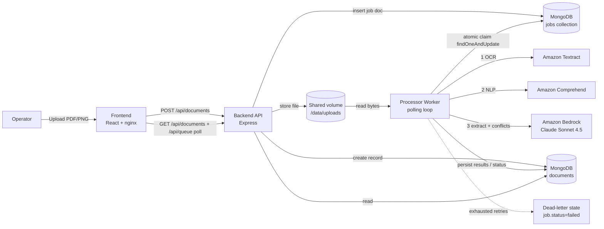

# Architecture

## 1. Overview

The Insurance Intelligence Pipeline (IIP) is a decoupled microservices system
that turns unstructured insurance documents (policy declarations, claim forms,
endorsements) into structured data plus a list of detected **conflicts**.

The guiding principle is **temporal decoupling**: a fast ingress API accepts
uploads and immediately returns `202 Accepted`, while a separate worker pool does
the slow, expensive AI processing asynchronously. This keeps the API responsive
under bursty load and isolates failures.

## 2. Component diagram



## 3. Processing pipeline (worker)

Each job runs three stages, persisting progress after each so the frontend shows
live status (`ocr → comprehend → llm → done`):

1. **Textract (OCR)** — `AnalyzeDocument` with the `FORMS` feature. Produces raw
   text (LINE blocks) and key/value pairs (KEY_VALUE_SET blocks). Synchronous API
   (single page, ≤10 MB; JPEG/PNG/PDF/TIFF).
2. **Comprehend (NLP)** — `DetectDominantLanguage`, `DetectEntities`,
   `DetectPiiEntities`, `DetectKeyPhrases`, `DetectSentiment`. Flags PII exposure
   and enriches the LLM prompt. (Text is clamped to Comprehend's 5000-byte limit.)
3. **Bedrock / Claude Sonnet 4.5 (reasoning)** — receives OCR text + key/value
   pairs + Comprehend entities and returns a strict JSON object with structured
   fields, a `conflicts[]` array (each with `field`, `type`, `severity`,
   `description`, `evidence[]`), and a human summary. Invoked via `InvokeModel`
   using the **global cross-Region inference profile**
   `global.anthropic.claude-sonnet-4-5-20250929-v1:0`.

A weighted **risk score (0–100)** is computed from conflict severities
(`low=18, medium=36, high=54, critical=72`, saturating at 100).

### Conflict types detected

| Type | Example | Severity |
|------|---------|----------|
| `coverage_violation` | Claim amount exceeds coverage limit | critical |
| `coverage_date_violation` | Date of loss outside policy term | high |
| `date_inconsistency` | Expiration on/before effective date | high |
| `identifier_mismatch` | Two different policy numbers in one doc | high |
| `name_mismatch` | Insured vs. claimant / signature mismatch | medium/low |

## 4. Queue, retries & dead-letter (MongoDB polling queue)

No Redis or BullMQ — the queue is a plain MongoDB `jobs` collection that workers
poll. Each job document has: `type`, `status` (`pending|active|completed|failed`),
`data`, `attempts`, `maxAttempts`, `availableAt`, `lockedAt`, `lockedBy`, and
result/error fields.

- **Enqueue** (`backend/src/services/jobs.js`): insert a `pending` job.
- **Claim** (`processor/src/queue.js`): every `POLL_INTERVAL_MS` (default 1000ms)
  a worker runs an **atomic** claim:
  ```js
  JobModel.findOneAndUpdate(
    { status: 'pending', availableAt: { $lte: now } },
    { $set: { status: 'active', lockedAt: now, lockedBy: workerId, startedAt: now },
      $inc: { attempts: 1 } },
    { sort: { priority: -1, availableAt: 1, createdAt: 1 }, new: true }
  )
  ```
  Because `findOneAndUpdate` is atomic, running **multiple worker replicas** is
  safe — only one wins each job.
- **Concurrency**: a worker keeps claiming until `WORKER_CONCURRENCY` (default 2)
  jobs are in flight, then tops up as each finishes.
- **Retries**: on failure the job is rescheduled `pending` with `availableAt =
  now + retryBackoffMs * 2^(attempts-1)` (exponential backoff, 2s base).
- **Dead-letter**: once `attempts >= maxAttempts` (default 3) the job is marked
  `failed` (retained for auditing) and the document is set `status=failed`,
  `stage=error`.
- **Stale-lock recovery**: jobs stuck in `active` past `STALE_LOCK_MS` (default
  60s) — e.g. a crashed worker — are reset to `pending` and picked up again.

Trade-off vs. a broker like Redis/BullMQ: polling adds a small, bounded latency
(≤ one poll interval) and periodic light queries, in exchange for **zero extra
infrastructure** — one datastore for both state and queue — which is ideal for
this demo and small/medium throughput. For very high throughput, a push-based
broker or MongoDB **change streams** (tailing the `jobs` collection) would remove
the poll latency.

## 5. Data model (MongoDB `documents`)

```jsonc
{
  "documentId": "uuid",
  "originalName": "home-claim-conflicting.pdf",
  "mimeType": "application/pdf",
  "status": "queued|processing|completed|failed",
  "stage":  "queued|ocr|comprehend|llm|persist|done|error",
  "provider": "aws|mock",
  "ocr":       { "text": "...", "lineCount": 14, "keyValues": [{ "key": "...", "value": "..." }], "rawBlockCount": 96 },
  "comprehend":{ "dominantLanguage": "en", "sentiment": "NEUTRAL", "entities": [], "piiEntities": [], "keyPhrases": [], "containsPii": true },
  "extraction":{ "documentType": "Homeowners Claim Form", "policyNumber": "POL-HOME-9901", "insuredName": "Dana Whitmore", "coverageAmount": "$50,000", "claimAmount": "$85,000", "...": "..." },
  "conflicts": [{ "field": "Amount Claimed", "type": "coverage_violation", "severity": "critical", "description": "...", "evidence": ["...", "..."] }],
  "riskScore": 72,
  "summary": "Homeowners Claim Form contains 4 conflict(s)...",
  "timings": { "ocrMs": 812, "comprehendMs": 240, "llmMs": 1900 }
}
```

Why MongoDB? Insurance intake objects vary drastically across lines of business
(auto, home, commercial, life). A flexible document store (`strict:false`-style
schema with a `fields` catch-all) avoids constant relational migrations as new
document types arrive.

## 6. Why these choices (trade-offs)

- **Async queue over synchronous API** — protects ingress latency (single Mongo
  insert on enqueue) from slow, variable AI calls; enables independent horizontal
  scaling of the worker pool.
- **MongoDB polling queue over Redis/BullMQ** — one datastore for both state and
  queue, no extra broker to run or secure. Atomic `findOneAndUpdate` keeps it
  correct under multiple workers; the cost is a small poll latency (see §4).
- **Node.js everywhere** — one language across gateway, worker, tooling; native
  fit for I/O-bound orchestration of network calls to AWS.
- **Textract → Comprehend → Bedrock ordering** — deterministic OCR first, cheap
  structured NLP second, then the LLM does the expensive reasoning with the
  richest possible context (raw text + KV pairs + entities), which improves
  extraction accuracy and reduces hallucination.
- **Mock provider abstraction** — every AWS call has a deterministic mock behind
  the same interface, so the system is demoable offline and testable in CI without
  incurring cost or requiring credentials.

## 7. Scaling & production notes

- Multi-page / large PDFs: the processor currently splits multi-page PDFs locally
  and calls synchronous Textract `AnalyzeDocument` per page. For large or
  high-volume documents, switch to Textract **async** (`StartDocumentTextDetection`
  / `StartDocumentAnalysis`) with an S3 source and SNS/SQS completion.
- Replace the shared upload volume with **S3** and pass object keys through the queue.
- Run multiple `processor` replicas; the atomic claim ensures each job runs once.
- For higher throughput / lower latency, replace polling with MongoDB **change
  streams** on the `jobs` collection, or move to a dedicated broker (SQS, Redis).
- Add Bedrock Guardrails and Comprehend PII **redaction** before persistence for
  compliance.
